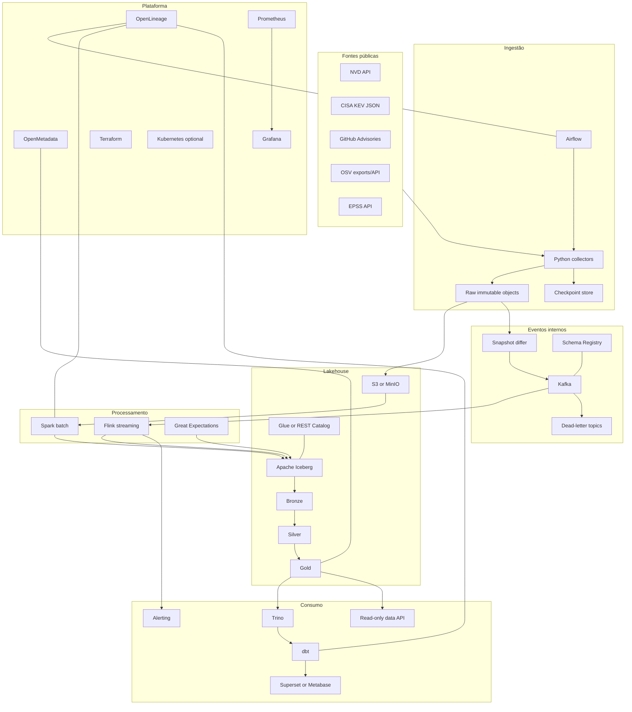

# VulnPulse — Vulnerability Intelligence Data Platform

> Blueprint de execução para uma plataforma extraordinária de Engenharia de Dados baseada exclusivamente em inteligência pública e defensiva sobre vulnerabilidades.

## Metadados do projeto

| Campo | Valor |
|---|---|
| Nome | VulnPulse |
| Domínio | Vulnerability Intelligence / Cybersecurity defensiva |
| Prioridade | Projeto a executar agora |
| Fonte principal | APIs e exports públicos oficiais |
| Natureza | Batch incremental + eventos internos de mudança |
| Arquitetura | Lakehouse com processamento batch e streaming |
| Nível-alvo | Pleno forte, com tópicos de arquitetura avançada |
| Duração sugerida | 12 a 20 semanas em execução individual |
| Resultado principal | Fila transparente de priorização e histórico de mudanças |
| Restrição | Não inclui exploração, ataque ou varredura ofensiva |

---

## 1. Resumo executivo

O VulnPulse reunirá dados reais de vulnerabilidades publicados por NVD, CISA KEV, GitHub Advisory Database, OSV e EPSS. A plataforma preservará cada payload recebido, detectará alterações, resolverá aliases entre fontes, manterá histórico temporal e produzirá produtos de dados para priorização defensiva.

O diferencial não será afirmar que Kafka, Flink e Spark foram utilizados. O diferencial será provar:

- carga histórica completa;
- ingestão incremental correta;
- tolerância a rate limits;
- detecção de mudanças retroativas;
- resolução de entidades;
- histórico de severidade e exploração;
- reconciliação entre fontes;
- processamento de eventos internos;
- qualidade, lineage e observabilidade;
- recuperação após falhas;
- infraestrutura reproduzível.

A plataforma não tratará CVSS como verdade absoluta. Ela combinará severidade, probabilidade de exploração, presença no catálogo KEV, disponibilidade de correção, idade e qualidade das fontes em um score explicável.

---

## 2. Problema de negócio

Equipes de segurança recebem mais vulnerabilidades do que conseguem corrigir. Os registros são distribuídos entre fontes, mudam ao longo do tempo e podem discordar.

Perguntas centrais:

- Quais vulnerabilidades merecem atenção imediata?
- Quais foram adicionadas ao KEV?
- Quais tiveram aumento de EPSS?
- Quais possuem correção conhecida?
- Quais pacotes e versões são afetados?
- Quais fontes discordam sobre severidade ou aliases?
- Quanto tempo passou entre publicação, correção e exploração conhecida?
- Quais vulnerabilidades mudaram nas últimas 24 horas?
- Qual é a qualidade e freshness de cada fonte?
- É possível reproduzir o estado conhecido em uma data passada?

### Usuários simulados do produto

- equipe de vulnerability management;
- security operations;
- engenharia de plataforma;
- gestores de risco;
- analistas de segurança;
- equipes responsáveis por dependências open source.

---

## 3. Objetivos mensuráveis

| Objetivo | Métrica de sucesso |
|---|---:|
| Preservar dados de origem | 100% das respostas válidas persistidas no Raw |
| Atualização incremental | Nenhuma janela temporal perdida |
| Idempotência | 0 duplicatas por chave de ingestão |
| Reconstrução | Silver e Gold reconstruíveis a partir do Raw |
| Rastreabilidade | 100% das linhas Gold com origem identificável |
| Freshness NVD/GitHub | Dentro do intervalo definido pelo coletor |
| Freshness KEV/EPSS | Até uma execução após publicação |
| Reconciliação | Divergências explicadas e quantificadas |
| Histórico | Toda mudança relevante gera nova versão |
| Qualidade | Regras críticas bloqueiam publicação |
| Recuperação | Reexecução automática após falha transitória |
| Documentação | Reprodução por terceiro sem conhecimento prévio |

---

## 4. Escopo

### Incluído

- ingestão histórica e incremental;
- persistência imutável dos payloads;
- schemas versionados;
- normalização de CVE, GHSA, OSV, CPE, CWE, pacotes e versões;
- aliases e resolução de entidades;
- histórico de mudanças;
- score defensivo explicável;
- alertas de mudança;
- lakehouse;
- catálogo, lineage e observabilidade;
- execução local e evolução para AWS;
- testes de falha;
- produtos analíticos.

### Fora do escopo inicial

- exploração de vulnerabilidades;
- código de prova de conceito;
- scanner de redes;
- coleta de dados privados;
- automação de patch;
- substituição de ferramentas corporativas de segurança;
- classificação de pessoas ou organizações;
- uso de IA para tomar decisões sem explicação.

---


## Princípios de arquitetura

1. **Problema antes da ferramenta.** Nenhum componente entra apenas por popularidade.
2. **Raw imutável.** Toda resposta externa é preservada antes de qualquer transformação.
3. **Reprocessamento como requisito.** A camada Bronze deve permitir reconstruir Silver e Gold.
4. **Idempotência.** Reexecutar ingestões ou transformações não pode duplicar resultados.
5. **Contratos explícitos.** Schemas, tipos, chaves, semântica e versionamento ficam no repositório.
6. **Observabilidade desde a primeira fase.** Cada execução informa origem, período, contagem, duração, falhas e saída.
7. **Qualidade por camadas.** Validação de transporte, schema, domínio, relacionamento e produto.
8. **Arquitetura evolutiva.** Local primeiro, cloud depois de critérios objetivos.
9. **Segurança por padrão.** Segredos fora do Git, menor privilégio e trilha de auditoria.
10. **Custo mensurado.** Recursos avançados precisam de orçamento, métricas e justificativa.
11. **Documentação executável.** Diagramas, ADRs, runbooks e exemplos devem acompanhar o código.
12. **Evidência acima de promessa.** Cada tecnologia deve aparecer em um cenário reproduzível de sucesso e falha.


## 5. Fontes de dados reais

### 5.1 NVD API 2.0

Responsabilidade:

- registros CVE;
- descrições;
- métricas CVSS;
- CWE;
- configurações CPE;
- referências;
- histórico de modificação.

Estratégia:

```text
carga inicial paginada
→ checkpoint por startIndex
→ armazenamento de cada página
→ carga incremental por lastModStartDate/lastModEndDate
→ janela de sobreposição
→ comparação de hash
```

Regras:

- usar API key;
- respeitar recomendações oficiais;
- centralizar requisições;
- registrar headers e status;
- não consultar mais que o necessário;
- usar UTC;
- manter watermark de ingestão separado do timestamp da fonte.

### 5.2 CISA Known Exploited Vulnerabilities

Responsabilidade:

- sinal de exploração conhecida;
- data de inclusão;
- prazo de correção indicado;
- vendor e produto;
- ransomware conhecido quando informado;
- ação recomendada pela fonte.

Estratégia:

- baixar JSON oficial;
- persistir o arquivo integral;
- comparar versões;
- gerar eventos de entrada, alteração e remoção;
- validar com JSON Schema oficial quando disponível.

### 5.3 GitHub Global Security Advisories

Responsabilidade:

- GHSA;
- aliases CVE;
- ecossistemas;
- pacotes;
- intervalos vulneráveis;
- primeira versão corrigida;
- CVSS;
- CWE;
- datas de revisão e atualização.

Estratégia:

- carga histórica paginada;
- filtro incremental por `modified`;
- ETag quando aplicável;
- tolerância a advisories retirados;
- persistência de resposta e headers.

### 5.4 OSV

Responsabilidade:

- vulnerabilidades por ecossistema;
- aliases;
- eventos de versão;
- ranges;
- commits quando presentes;
- detalhes específicos do ecossistema.

Estratégia recomendada:

- exports oficiais por ecossistema para carga histórica;
- API para enriquecimento e validações pontuais;
- checksum do arquivo;
- catálogo de ecossistemas;
- processamento paralelo por ecossistema.

### 5.5 EPSS

Responsabilidade:

- probabilidade de exploração;
- percentil;
- histórico diário.

Estratégia:

- captura diária;
- particionamento por data;
- histórico append-only;
- validação de faixa entre 0 e 1;
- comparação com dia anterior;
- evento de mudança relevante.

### 5.6 Fontes opcionais futuras

- CVE.org para metadados adicionais;
- catálogo CPE completo;
- package registries para metadados de pacotes;
- SBOMs públicos ou fornecidos pelo usuário;
- feeds de vendors, somente após análise de licença e qualidade.

### Registro obrigatório por fonte

| Campo | Descrição |
|---|---|
| source_name | Nome estável |
| source_url | Endpoint ou objeto |
| fetched_at | Momento da captura |
| source_modified_at | Momento informado pela fonte |
| http_status | Resultado HTTP |
| etag | ETag quando disponível |
| checksum | Hash do payload |
| request_parameters | Filtros usados |
| run_id | Execução |
| object_uri | Local do Raw |
| schema_version | Contrato conhecido |
| record_count | Contagem extraída |
| license | Licença e atribuição |

---

## 6. Arquitetura-alvo



### Verdade arquitetural

As fontes externas são consultadas por polling ou download. O streaming do projeto nasce da **detecção de mudanças reais** entre snapshots. Isso não deve ser chamado de streaming nativo da fonte nem de CDC de log transacional.

---

## 7. Responsabilidade das ferramentas

| Ferramenta | Responsabilidade | Critério de entrada |
|---|---|---|
| Python | Clientes, parsing e contratos | Fase inicial |
| Airflow | Orquestrar cargas e dependências | Dois ou mais pipelines estáveis |
| Kafka | Distribuir mudanças e permitir replay | Change detector comprovado |
| Schema Registry | Compatibilidade de eventos | Primeiro tópico versionado |
| Flink | Estado, correlação e alertas | Eventos e regras com baixa latência |
| Spark | Backfill, normalização em massa e entity resolution | Carga histórica |
| S3/MinIO | Objetos Raw e arquivos Parquet | Fase inicial |
| Iceberg | Snapshots, upserts, time travel e evolução | Silver |
| Trino | SQL federado sobre Iceberg | Primeiras tabelas |
| dbt | Modelos Gold, testes e documentação | Silver estável |
| Great Expectations | Entrada, distribuição e regras complexas | Primeira carga |
| OpenLineage | Linhagem operacional | Jobs estáveis |
| OpenMetadata | Descoberta, ownership e catálogo | Produtos Gold |
| Prometheus | Métricas | Primeira ingestão |
| Grafana | Dashboards e alertas | Métricas disponíveis |
| Docker | Reprodução local | Dia 1 |
| Kubernetes | Isolamento e operação distribuída | Gate explícito |
| Terraform | Infraestrutura reproduzível | Primeira implantação cloud |
| GitHub Actions | CI/CD | Dia 1 |

---

## 8. Eventos de domínio

### Tópicos

```text
vulnpulse.vulnerability.discovered.v1
vulnpulse.vulnerability.updated.v1
vulnpulse.vulnerability.withdrawn.v1
vulnpulse.vulnerability.kev-added.v1
vulnpulse.vulnerability.epss-changed.v1
vulnpulse.vulnerability.patch-available.v1
vulnpulse.vulnerability.risk-changed.v1
vulnpulse.source.ingestion-status.v1
vulnpulse.dead-letter.v1
```

### Chave de particionamento

```text
canonical_vulnerability_id
```

Isso preserva ordem relativa por vulnerabilidade.

### Envelope canônico

```json
{
  "event_id": "uuid",
  "event_type": "vulnerability.updated",
  "event_version": 1,
  "occurred_at": "timestamp da mudança na fonte",
  "detected_at": "timestamp da detecção",
  "published_at": "timestamp de publicação",
  "source": "nvd",
  "source_record_id": "CVE-2026-00001",
  "canonical_vulnerability_id": "CVE-2026-00001",
  "change_set": {
    "changed_fields": ["cvss_v4.score", "references"],
    "before_hash": "sha256",
    "after_hash": "sha256"
  },
  "trace": {
    "run_id": "uuid",
    "raw_object_uri": "s3://...",
    "commit_sha": "git-sha"
  }
}
```

### Compatibilidade

- novos campos opcionais: permitido;
- remoção de campo: incompatível;
- alteração de tipo: incompatível;
- alteração de semântica: nova versão;
- consumidores devem ignorar campos desconhecidos;
- DLQ deve preservar payload e motivo.

---

## 9. Organização do lakehouse

```text
s3://vulnpulse/
├── raw/
│   ├── nvd/
│   ├── cisa-kev/
│   ├── github-advisories/
│   ├── osv/
│   └── epss/
├── bronze/
├── silver/
├── gold/
├── checkpoints/
├── quarantine/
├── spark/
├── flink/
└── temporary/
```

### Raw

Formato original, sem mutação:

```text
raw/{source}/ingestion_date=YYYY-MM-DD/run_id=<uuid>/part-*.json
```

Metadados separados:

```text
request.json
response_headers.json
manifest.json
checksum.sha256
```

### Bronze

Tabelas por fonte com tipagem mínima:

```text
bronze.nvd_cve_snapshot
bronze.cisa_kev_snapshot
bronze.github_advisory_snapshot
bronze.osv_advisory_snapshot
bronze.epss_daily
bronze.ingestion_manifest
```

### Silver

Entidades normalizadas:

```text
silver.vulnerability
silver.vulnerability_version
silver.vulnerability_alias
silver.severity_assessment
silver.affected_package
silver.affected_product
silver.cwe
silver.reference
silver.exploitation_signal
silver.patch_signal
silver.source_record
silver.source_disagreement
silver.change_event
```

### Gold

Produtos:

```text
gold.vulnerability_priority_queue
gold.newly_exploited_vulnerabilities
gold.risk_score_history
gold.package_exposure_catalog
gold.source_quality_scorecard
gold.source_disagreement_report
gold.patch_availability_sla
gold.daily_vulnerability_trends
```

---

## 10. Grãos e chaves

### `silver.vulnerability`

Grão: uma vulnerabilidade canônica.

Chave:

```text
canonical_vulnerability_id
```

Prioridade de identificação:

1. CVE quando confiável;
2. alias canônico definido por regra;
3. ID sintético determinístico para registros sem CVE.

### `silver.vulnerability_version`

Grão: uma versão temporal de uma vulnerabilidade canônica.

Campos:

```text
vulnerability_version_key
canonical_vulnerability_id
valid_from
valid_to
is_current
content_hash
change_reason
source_precedence_version
```

### `silver.source_record`

Grão: uma versão de um registro em uma fonte.

```text
source
source_record_id
source_modified_at
detected_at
content_hash
raw_object_uri
```

### `silver.affected_package`

Grão:

```text
vulnerabilidade + ecossistema + pacote + intervalo afetado
```

### Estratégia de surrogate keys

Hash estável de campos naturais normalizados. O algoritmo e a ordem dos campos devem ser versionados.

---

## 11. Resolução de entidades

### Problemas

- aliases incompletos;
- um GHSA com CVE;
- um registro OSV agregando outra fonte;
- nomes de pacote com diferenças de caixa;
- vendor e produto inconsistentes;
- múltiplas métricas CVSS;
- referências duplicadas.

### Pipeline

```text
normalização
→ exact match por alias
→ match por referência oficial
→ match por pacote/ecossistema/faixa
→ regras de confiança
→ fila de ambiguidades
→ decisão auditável
```

### Níveis de confiança

| Nível | Regra |
|---|---|
| 1.0 | Mesmo CVE explícito |
| 0.95 | Alias oficial compartilhado |
| 0.85 | Referência cruzada forte |
| 0.70 | Pacote, intervalo e descrição coerentes |
| <0.70 | Não consolidar automaticamente |

### Tabela de decisão

```text
silver.entity_resolution_decision
```

Campos:

```text
candidate_left
candidate_right
decision
confidence
rule_id
evidence
decided_at
pipeline_version
```

Nenhuma decisão deve depender apenas de similaridade textual sem evidência adicional.

---

## 12. Score de priorização

O score deve ser explicável, versionado e acompanhado dos componentes.

### Componentes possíveis

| Componente | Exemplo |
|---|---|
| Exploração conhecida | Presença no KEV |
| Probabilidade | EPSS |
| Severidade | CVSS v3/v4 |
| Impacto | Métricas de confidencialidade, integridade e disponibilidade |
| Patch | Correção ausente ou disponível |
| Exposição | Ecossistemas e pacotes afetados |
| Recência | Publicação ou mudança recente |
| Ransomware | Sinal informado pela fonte |
| Confiança | Concordância entre fontes |
| Idade | Tempo sem correção |

### Regras

- score entre 0 e 100;
- cada componente armazenado;
- versão da fórmula registrada;
- nenhum componente oculto;
- score não significa certeza de exploração;
- alertas devem explicar por que o score mudou;
- pesos alterados exigem ADR e backfill;
- modelo estatístico ou ML somente depois de baseline determinístico.

### Exemplo de saída

```json
{
  "canonical_vulnerability_id": "CVE-2026-00001",
  "risk_score": 87.4,
  "score_version": "v1",
  "components": {
    "kev": 30,
    "epss": 22.4,
    "cvss": 20,
    "patch": 10,
    "recency": 5
  },
  "explanation": [
    "incluída no KEV",
    "EPSS acima do percentil definido",
    "sem versão corrigida conhecida"
  ]
}
```

---

## 13. Processamento batch

### Spark

Jobs principais:

```text
bootstrap_nvd_history
bootstrap_github_history
bootstrap_osv_ecosystem
normalize_source_records
resolve_vulnerability_entities
rebuild_vulnerability_versions
recompute_risk_history
compact_iceberg_tables
reconcile_sources
```

### Particionamento

- Bronze: `source` e data de ingestão;
- versões: mês de `valid_from`;
- EPSS: data;
- eventos: data de detecção;
- Gold: particionamento compatível com consultas.

Evitar particionamento por CVE, pois gera alta cardinalidade.

### Manutenção Iceberg

- compactação de small files;
- expiração de snapshots conforme retenção;
- remoção segura de arquivos órfãos;
- monitoramento de manifests;
- evolução de particionamento;
- testes de time travel;
- rollback documentado.

---

## 14. Processamento streaming

### Flink

Casos válidos:

- mudança de score;
- entrada no KEV;
- aumento relevante de EPSS;
- correlação de atualização entre fontes;
- atualização de estado por vulnerabilidade;
- deduplicação por `event_id`;
- tratamento de eventos atrasados;
- alertas;
- sinks idempotentes.

### Event time

Usar `occurred_at` quando a fonte informa a mudança. Caso contrário, usar `detected_at` e registrar a limitação.

### Watermarks

Definir com base no comportamento observado, não por conveniência. Eventos além da tolerância devem seguir para:

```text
vulnpulse.late-events.v1
```

### Estado

```text
canonical_vulnerability_id
last_risk_score
last_kev_status
last_epss
last_patch_status
last_event_version
```

### Exactly-once

A documentação deve separar:

- semântica do Kafka;
- checkpoints do Flink;
- idempotência do sink;
- transações do Iceberg;
- comportamento de alertas externos.

Não afirmar exactly-once ponta a ponta sem experimento reproduzível.

---

## 15. Orquestração

### DAGs

```text
nvd_incremental
github_advisories_incremental
cisa_kev_snapshot
osv_bulk_refresh
epss_daily
bronze_to_silver
entity_resolution
gold_products
iceberg_maintenance
source_reconciliation
quality_and_publish
```

### Exemplo de dependência

```text
collect_nvd
→ validate_manifest
→ register_raw
→ load_bronze
→ detect_changes
→ publish_events
→ run_quality
→ update_checkpoint
```

O checkpoint só pode avançar depois da persistência e validação.

### Backfills

- parametrizados por fonte e janela;
- sem alteração manual no código;
- reexecutáveis;
- com limites;
- com dry-run;
- com relatório final;
- sem misturar watermark operacional e data de negócio.

---

## 16. Modelagem dbt

### Camadas

```text
staging
intermediate
marts
```

### Staging

Um modelo por tabela Silver, com:

- renomeação;
- tipos;
- timezone;
- flags;
- documentação;
- remoção apenas de campos técnicos desnecessários.

### Intermediate

- aliases consolidados;
- severidade preferencial;
- estado corrente;
- histórico de score;
- disponibilidade de patch;
- divergência entre fontes;
- eventos de mudança.

### Marts

- priority queue;
- daily trends;
- source scorecard;
- patch SLA;
- newly exploited;
- package catalog.

### Testes dbt

- unique;
- not_null;
- relationships;
- accepted_values;
- freshness;
- singular tests;
- unit tests para regras críticas;
- contracts nos modelos Gold.

---

## 17. Produtos de dados

### 17.1 Vulnerability Priority Queue

Grão: uma vulnerabilidade no estado atual.

Campos:

```text
canonical_vulnerability_id
primary_title
risk_score
risk_tier
kev_status
epss
epss_percentile
cvss_preferred
patch_available
affected_ecosystems
published_at
last_modified_at
score_explanation
source_count
confidence_level
```

### 17.2 Newly Exploited Vulnerabilities

Mostra entradas recentes no KEV, alterações e contexto.

### 17.3 Source Disagreement Report

Compara:

- severidade;
- aliases;
- datas;
- status;
- patches;
- ecossistemas;
- descrições.

### 17.4 Patch Availability SLA

Mede tempo entre publicação e primeira correção conhecida.

### 17.5 Source Quality Scorecard

Métricas por fonte:

- freshness;
- disponibilidade;
- taxa de erro;
- alterações retroativas;
- campos ausentes;
- divergências;
- atraso de publicação.

---

## 18. Qualidade de dados

### Entrada

- status HTTP esperado;
- MIME type;
- checksum;
- JSON válido;
- schema;
- paginação;
- contagem;
- data de atualização;
- arquivo não vazio.

### Domínio

```text
CVE em formato válido quando presente
EPSS entre 0 e 1
CVSS no intervalo esperado
datas coerentes
alias não vazio
ecossistema reconhecido
intervalo vulnerável parseável
KEV com data de inclusão
```

### Relacionamentos

- alias aponta para vulnerabilidade existente;
- affected package possui source record;
- versão atual única;
- score possui versão de fórmula;
- Gold aponta para Silver;
- todo evento aponta para Raw.

### Quarentena

```text
quarantine.invalid_source_record
quarantine.unresolved_alias
quarantine.invalid_version_range
quarantine.schema_break
quarantine.late_event
```

Registro de quarentena:

```text
error_code
failed_rule
payload_reference
source
detected_at
run_id
retryable
resolution_status
```

---


## Estratégia de testes

### Testes unitários

Cobrem:

- parsing;
- normalização;
- geração de chaves;
- comparação de snapshots;
- tratamento de datas;
- regras de negócio;
- serialização;
- validação de contratos.

### Testes de contrato

Validam:

- presença e tipo dos campos;
- compatibilidade entre versões;
- valores obrigatórios;
- enums;
- chaves de negócio;
- semântica de timestamps;
- tolerância a novos campos;
- rejeição de mudanças incompatíveis.

### Testes de integração

Executam caminhos reais entre componentes:

```text
API → Raw storage
Raw → Spark → Iceberg
Producer → Kafka → Consumer
Kafka → Flink → Iceberg
Iceberg → Trino → dbt
Airflow → job → data quality → publicação
```

### Testes end-to-end

Um cenário E2E precisa:

1. adquirir um conjunto real pequeno;
2. persistir o payload bruto;
3. criar ou atualizar registros Silver;
4. produzir um produto Gold;
5. executar testes;
6. consultar o resultado pelo Trino;
7. comparar com uma expectativa conhecida;
8. registrar métricas e lineage.

### Testes de regressão

Fixtures reais, anonimizadas quando necessário, devem proteger:

- bugs já encontrados;
- payloads incompletos;
- campos adicionais;
- registros duplicados;
- datas fora de ordem;
- alterações retroativas;
- falhas de codificação;
- paginação interrompida.

### Testes de falha

O projeto deve demonstrar pelo menos:

- timeout da API;
- resposta `429`;
- resposta `5xx`;
- página parcialmente persistida;
- job reiniciado;
- mensagem duplicada;
- evento atrasado;
- schema incompatível;
- arquivo corrompido;
- indisponibilidade temporária do catálogo;
- reprocessamento completo.


## 19. Experimentos obrigatórios

1. Interromper carga NVD na metade da paginação e retomar.
2. Repetir exatamente a mesma janela incremental.
3. Alterar ordem dos campos sem mudar conteúdo.
4. Duplicar evento Kafka.
5. Enviar atualização antiga após uma nova.
6. Reiniciar Flink durante checkpoint.
7. Simular resposta `429`.
8. Simular novo campo compatível.
9. Simular alteração incompatível.
10. Remover temporariamente o catálogo.
11. Corromper objeto Raw e detectar checksum.
12. Recalcular score com nova versão e comparar.
13. Fazer rollback Iceberg.
14. Reprocessar uma fonte inteira.
15. Comparar contagens entre Raw, Bronze, Silver e Gold.

Cada experimento deve possuir:

- hipótese;
- preparação;
- execução;
- resultado esperado;
- resultado observado;
- métricas;
- logs;
- evidência;
- conclusão.

---


## Observabilidade

### Métricas mínimas por coletor

```text
requests_total
request_duration_seconds
http_errors_total
rate_limit_events_total
records_received_total
records_persisted_total
records_rejected_total
pages_processed_total
checkpoint_timestamp
source_freshness_seconds
```

### Métricas de processamento

```text
input_records_total
output_records_total
duplicate_records_total
late_records_total
quarantine_records_total
job_duration_seconds
job_failures_total
checkpoint_duration_seconds
consumer_lag
table_freshness_seconds
```

### Logs

Logs estruturados em JSON devem incluir:

```text
timestamp
level
service
run_id
dataset
source
partition
checkpoint
record_count
duration_ms
error_type
trace_id
commit_sha
```

### Alertas

Alertas precisam ser acionáveis. Cada alerta deve apontar para:

- SLO afetado;
- dashboard;
- runbook;
- última execução válida;
- possível causa;
- prioridade;
- procedimento de silenciamento.


### Dashboards específicos

#### Source Health

- disponibilidade por fonte;
- latência;
- códigos HTTP;
- rate limits;
- freshness;
- páginas;
- checkpoints.

#### Change Intelligence

- vulnerabilidades novas;
- alteradas;
- entradas no KEV;
- variações de EPSS;
- divergências;
- alertas.

#### Lakehouse

- arquivos;
- tamanho médio;
- snapshots;
- manifests;
- compactação;
- crescimento;
- tempo de consulta.

#### Streaming

- lag;
- throughput;
- checkpoints;
- backpressure;
- late events;
- DLQ;
- estado.

---


## Governança, catálogo e linhagem

### Catálogo empresarial

OpenMetadata deve registrar:

- owners;
- domínio;
- descrição;
- classificação;
- nível de qualidade;
- SLO;
- consumidores;
- dependências;
- tags;
- exemplos de uso;
- data de última atualização.

### Linhagem

OpenLineage deve capturar:

```text
source
→ ingestion run
→ raw object
→ Bronze table
→ Silver model
→ Gold product
→ dashboard ou API
```

### ADRs

Toda decisão relevante recebe um Architecture Decision Record contendo:

- contexto;
- opções consideradas;
- decisão;
- consequências;
- riscos;
- condição de revisão.

### Runbooks

Cada pipeline crítico possui um runbook com:

- sintomas;
- métricas a verificar;
- consultas de diagnóstico;
- procedimento de recuperação;
- reprocessamento;
- contatos e ownership;
- critérios de encerramento do incidente.


### Classificação sugerida

| Dataset | Classificação |
|---|---|
| Payloads públicos | Public |
| Configuração interna | Internal |
| Credenciais | Restricted |
| Métricas operacionais | Internal |
| Resultados agregados | Public/Internal conforme implantação |

---


## Segurança

- credenciais somente em variáveis de ambiente ou secret manager;
- `.env.example` sem valores reais;
- rotação de chaves;
- TLS quando disponível;
- buckets privados;
- IAM por workload;
- contas de serviço separadas;
- RBAC no Kubernetes;
- logs sem tokens;
- imagens com usuário não root;
- varredura de dependências e imagens;
- assinatura e versionamento de artefatos;
- trilha de auditoria para alterações em regras;
- política de retenção;
- inventário de dados e licenças.

O projeto deve processar somente dados públicos e respeitar termos, limites e licenças das fontes.


### Limite ético do projeto

A plataforma é defensiva. Ela organiza informações públicas para priorização e pesquisa. O repositório não deve incluir instruções de exploração, payloads ofensivos ou automação de ataque.

---


## Estratégia de ambientes

### Ambiente local

O ambiente local deve ser reproduzível com Docker Compose e perfis de execução:

```text
profile=core
profile=streaming
profile=observability
profile=governance
profile=full
```

O perfil `core` deve funcionar em uma máquina de desenvolvimento razoável. Componentes pesados devem ser opcionais.

### Ambiente de integração

Executado no CI ou em uma máquina dedicada, com:

- datasets reduzidos, porém reais;
- serviços efêmeros;
- testes de integração;
- contratos;
- smoke tests;
- retenção curta;
- limpeza automática.

### Ambiente cloud

A evolução recomendada é AWS:

| Responsabilidade | Serviço sugerido |
|---|---|
| Object storage | Amazon S3 |
| Catálogo técnico | AWS Glue Data Catalog |
| Kafka gerenciado | Amazon MSK, apenas quando necessário |
| Kubernetes | Amazon EKS, somente após o gate de cloud |
| Segredos | AWS Secrets Manager |
| Métricas e logs | Managed Prometheus/Grafana ou stack própria |
| Identidade | IAM |
| Registro de imagens | Amazon ECR |
| Orquestração alternativa | MWAA, se houver orçamento e justificativa |

Terraform deve criar ambientes separados e reutilizar módulos. O projeto não deve depender de configurações manuais no console.


## 20. Arquitetura local recomendada

### Fase core

```text
PostgreSQL metadata
MinIO
Spark
Iceberg REST Catalog
Trino
Airflow
dbt
Prometheus
Grafana
```

### Perfil streaming

```text
Kafka
Schema Registry
Flink
Kafka UI
```

### Perfil governance

```text
OpenMetadata
OpenLineage/Marquez
```

O perfil completo não deve ser obrigatório para executar testes unitários ou uma ingestão simples.

---

## 21. Gate para Kubernetes e AWS

Só avançar quando:

- fluxo E2E local está estável;
- imagens são versionadas;
- configuração é externa;
- estado está em serviços persistentes;
- métricas e health checks existem;
- consumo de CPU e memória foi medido;
- custo mensal foi estimado;
- Terraform possui plan revisável;
- há rollback;
- o motivo do Kubernetes está escrito em ADR.

---

## 22. Estrutura do repositório

```text
vulnpulse/
├── README.md
├── Makefile
├── pyproject.toml
├── docker-compose.yml
├── .env.example
├── ingestion/
│   ├── common/
│   ├── nvd/
│   ├── cisa_kev/
│   ├── github_advisories/
│   ├── osv/
│   └── epss/
├── contracts/
│   ├── raw/
│   ├── events/
│   └── tables/
├── eventing/
│   ├── producers/
│   ├── schemas/
│   └── topics/
├── streaming/
│   └── flink/
├── processing/
│   ├── spark/
│   ├── entity_resolution/
│   └── reconciliation/
├── orchestration/
│   └── airflow/
├── transformation/
│   └── dbt/
├── quality/
│   ├── great_expectations/
│   └── rules/
├── lakehouse/
│   ├── ddl/
│   ├── maintenance/
│   └── catalog/
├── observability/
│   ├── prometheus/
│   ├── grafana/
│   ├── alerts/
│   └── logging/
├── metadata/
│   ├── openmetadata/
│   └── openlineage/
├── infrastructure/
│   ├── terraform/
│   ├── kubernetes/
│   └── helm/
├── tests/
│   ├── unit/
│   ├── contract/
│   ├── integration/
│   ├── regression/
│   ├── failure/
│   └── e2e/
├── docs/
│   ├── architecture/
│   ├── adr/
│   ├── runbooks/
│   ├── data_dictionary/
│   ├── experiments/
│   └── demos/
└── .github/workflows/
```

---


## CI/CD

### Pull request

```text
lint
→ format check
→ type checking
→ unit tests
→ contract tests
→ dbt parse/compile
→ Terraform validate
→ Docker build
→ dependency scan
→ secret scan
```

### Branch principal

```text
integration tests
→ create ephemeral environment
→ run reduced E2E
→ publish test reports
→ build versioned images
→ update development environment
→ smoke tests
```

### Release

```text
semantic tag
→ changelog
→ signed container images
→ infrastructure plan
→ manual approval
→ deploy
→ data migration
→ smoke tests
→ rollback plan
```

### Regras

- nenhum deploy direto a partir de notebook;
- imagens identificadas por commit SHA;
- dependências fixadas;
- migrations versionadas;
- Terraform plan revisado;
- segredos fornecidos pelo ambiente;
- rollback documentado;
- falha de qualidade crítica bloqueia publicação Gold.


## 23. SLOs e SLIs

| SLO | Meta inicial |
|---|---:|
| Freshness das fontes incrementais | Conforme schedule documentado |
| Sucesso de ingestão | ≥ 99% em janela mensal |
| Duplicatas Silver | 0 |
| Eventos sem Raw associado | 0 |
| Versões atuais duplicadas | 0 |
| Registros críticos em quarentena sem tratamento | 0 acima do prazo |
| Disponibilidade do Trino local durante demonstração | ≥ 99% na janela |
| Recuperação de coletor | Automática para falha transitória |
| RPO | Raw já persistido não pode ser perdido |
| RTO de pipeline | Definido por criticidade |
| Lineage Gold | 100% |
| Cobertura de testes de regras críticas | 100% das regras identificadas |

---

## 24. Custos e FinOps

Registrar:

- armazenamento Raw;
- crescimento diário;
- requisições;
- compute Spark;
- compute Flink;
- retenção Kafka;
- snapshots Iceberg;
- logs e métricas;
- tráfego;
- Kubernetes.

### Guardrails

- budget AWS;
- lifecycle no S3;
- retenção curta em dev;
- desligamento automático;
- instâncias pequenas;
- sem EKS antes do gate;
- compactação controlada;
- dashboards de custo;
- tags por projeto e ambiente.

---

## 25. Roadmap de execução

### Fase 0 — Contrato do projeto

Entregáveis:

- README;
- escopo;
- ADR-001;
- glossário;
- licença;
- convenções;
- Makefile;
- CI inicial.

Critério de saída:

- repositório clonado e validado por terceiro.

### Fase 1 — Cliente NVD e Raw

Entregáveis:

- cliente resiliente;
- paginação;
- retry com jitter;
- rate limit;
- checkpoint;
- payload Raw;
- manifest;
- testes.

Critério:

- uma janela real pode ser baixada e repetida sem duplicação.

### Fase 2 — CISA KEV e EPSS

Entregáveis:

- snapshots;
- checksums;
- validações;
- histórico diário EPSS;
- comparação de versões.

Critério:

- mudanças são detectadas de forma determinística.

### Fase 3 — GitHub e OSV

Entregáveis:

- ingestão histórica;
- incremental;
- exports OSV;
- catálogo de ecossistemas;
- contratos.

Critério:

- quatro fontes reconstruíveis a partir do Raw.

### Fase 4 — Lakehouse Bronze

Entregáveis:

- MinIO/S3;
- Iceberg;
- catálogo;
- tabelas Bronze;
- manifests de ingestão.

Critério:

- Trino consulta todas as fontes.

### Fase 5 — Silver canônica

Entregáveis:

- modelos normalizados;
- aliases;
- severidade;
- packages;
- versões;
- quarentena.

Critério:

- integridade e testes críticos aprovados.

### Fase 6 — Entity resolution

Entregáveis:

- regras;
- evidências;
- confiança;
- ambiguidades;
- relatório.

Critério:

- amostra revisada e regressão estabelecida.

### Fase 7 — Produtos dbt

Entregáveis:

- priority queue;
- trends;
- source scorecard;
- patch SLA;
- documentação.

Critério:

- produtos testados e compreensíveis por terceiro.

### Fase 8 — Kafka e eventos

Entregáveis:

- snapshot differ;
- schemas;
- tópicos;
- producer;
- DLQ;
- replay.

Critério:

- mudança real gera exatamente um evento lógico.

### Fase 9 — Flink

Entregáveis:

- deduplicação;
- estado;
- alertas;
- late events;
- checkpoints;
- sink Iceberg.

Critério:

- testes de reinício, duplicação e atraso documentados.

### Fase 10 — Observabilidade e lineage

Entregáveis:

- métricas;
- dashboards;
- alertas;
- OpenLineage;
- runbooks.

Critério:

- falha é diagnosticável sem abrir o código.

### Fase 11 — Cloud

Entregáveis:

- Terraform;
- S3;
- IAM;
- ECR;
- ambiente dev;
- orçamento;
- deployment.

Critério:

- ambiente pode ser destruído e recriado.

### Fase 12 — Kubernetes opcional

Entregáveis:

- manifests/Helm;
- probes;
- resources;
- autoscaling quando justificável;
- network policies.

Critério:

- Kubernetes resolve um problema medido.

### Fase 13 — Demonstração final

Entregáveis:

- vídeo curto;
- arquitetura;
- runbook;
- experimentos;
- custo;
- trade-offs;
- relatório de limitações.

Critério:

- entrevista técnica pode ser conduzida usando somente o repositório.

---

## 26. Ordem recomendada dos primeiros commits

1. `chore: initialize repository and quality gates`
2. `docs: define project scope and architecture principles`
3. `feat: add resilient HTTP client`
4. `feat: persist immutable raw responses`
5. `test: add raw manifest contract tests`
6. `feat: implement NVD pagination`
7. `feat: add ingestion checkpoints`
8. `test: cover interrupted pagination recovery`
9. `feat: ingest CISA KEV snapshot`
10. `feat: ingest EPSS daily data`
11. `feat: detect deterministic snapshot changes`
12. `infra: add MinIO and Iceberg catalog`
13. `feat: load NVD Bronze table`
14. `feat: add Trino catalog`
15. `feat: normalize canonical vulnerabilities`
16. `feat: model aliases and source records`
17. `test: add entity resolution regression suite`
18. `feat: add GitHub advisory ingestion`
19. `feat: add OSV bulk ingestion`
20. `feat: create vulnerability priority mart`
21. `feat: publish change events to Kafka`
22. `feat: process risk changes with Flink`
23. `obs: add ingestion and streaming dashboards`
24. `meta: emit OpenLineage events`
25. `infra: provision AWS development environment`

---

## 27. ADRs obrigatórios

```text
ADR-001 project scope
ADR-002 source selection
ADR-003 raw immutability
ADR-004 checkpoint semantics
ADR-005 Iceberg catalog
ADR-006 canonical vulnerability identity
ADR-007 entity resolution confidence
ADR-008 risk score design
ADR-009 Kafka event model
ADR-010 Flink state and watermark strategy
ADR-011 dbt versus Spark responsibilities
ADR-012 quarantine policy
ADR-013 cloud target
ADR-014 Kubernetes gate
ADR-015 retention and cost
```

---

## 28. Perguntas de entrevista que o projeto deve responder

- Por que Kafka se as fontes são APIs?
- Como você evita perder uma janela incremental?
- O que acontece quando uma vulnerabilidade é alterada retroativamente?
- Como diferencia alias de duplicata?
- Como prova idempotência?
- Como reprocessa todo o histórico?
- Por que Spark e Flink coexistem?
- Como escolheu o watermark?
- O score é reproduzível?
- O que ocorre quando fontes discordam?
- Como evita small files?
- Como testa schema evolution?
- Qual foi o custo?
- O que Kubernetes resolveu?
- Quais partes você removeria em uma empresa menor?

---

## 29. Anti-padrões proibidos

- chamar polling de streaming nativo;
- usar Kafka sem retenção e replay demonstrados;
- usar Flink apenas para copiar mensagens;
- usar Spark em datasets pequenos sem backfill;
- consolidar aliases por título parecido;
- sobrescrever Raw;
- avançar checkpoint antes da persistência;
- apagar registros inválidos;
- apresentar score como verdade absoluta;
- afirmar exactly-once sem teste;
- subir EKS apenas para citar Kubernetes;
- criar dashboard antes de qualidade e reconciliação.

---


## Definition of Done global

Uma fase só está concluída quando:

- código está versionado;
- testes relevantes passam;
- documentação foi atualizada;
- execução é reproduzível;
- métricas estão visíveis;
- falhas esperadas possuem tratamento;
- dados inválidos não desaparecem silenciosamente;
- segurança e licenças foram revisadas;
- custos foram estimados;
- há critério de rollback;
- existe evidência da execução;
- um terceiro consegue reproduzir seguindo o README.


## 30. Referências oficiais

- NVD Developer Start Here: https://nvd.nist.gov/developers/start-here
- NVD CVE API 2.0: https://nvd.nist.gov/developers/vulnerabilities
- CISA KEV: https://www.cisa.gov/known-exploited-vulnerabilities-catalog
- GitHub Global Security Advisories API: https://docs.github.com/en/rest/security-advisories/global-advisories
- OSV API: https://google.github.io/osv.dev/api/
- OSV data exports: https://google.github.io/osv.dev/data/
- EPSS API: https://api.first.org/epss/
- Apache Kafka: https://kafka.apache.org/documentation/
- Apache Flink: https://nightlies.apache.org/flink/flink-docs-stable/
- Apache Iceberg: https://iceberg.apache.org/docs/latest/
- Apache Airflow: https://airflow.apache.org/docs/apache-airflow/stable/
- Trino Iceberg connector: https://trino.io/docs/current/connector/iceberg.html
- dbt documentation: https://docs.getdbt.com/
- OpenLineage: https://openlineage.io/docs/
- OpenMetadata: https://docs.open-metadata.org/

> Verificar novamente endpoints, limites, licenças e versões antes da implementação. Registrar a data da verificação no repositório.

---

## 31. Primeiro marco executável

O primeiro marco não contém Kafka, Flink ou Kubernetes.

```text
NVD API real
→ cliente Python resiliente
→ Raw imutável
→ manifest e checksum
→ checkpoint
→ testes de interrupção
→ métricas
```

Quando esse caminho estiver sólido, a plataforma começa a crescer sobre fundações reais, em vez de virar uma cidade de ferramentas construída sobre areia.
